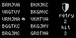

# ARDecipher (Arduboy game)

Similar to the terminal hack in Fallout 4. Find the password within 5 retries. Number of matched characters will be shown if you choose a non-password string.

[Play online](https://felipemanga.github.io/ProjectABE/?url=https://github.com/databhor/ARDecipher/releases/download/v1.0.0/ARDecipher.hex)

## 3rd-party Libraries

[Font4x6](https://github.com/filmote/Font4x6): Licensed under the BSD 3-Clause License.

